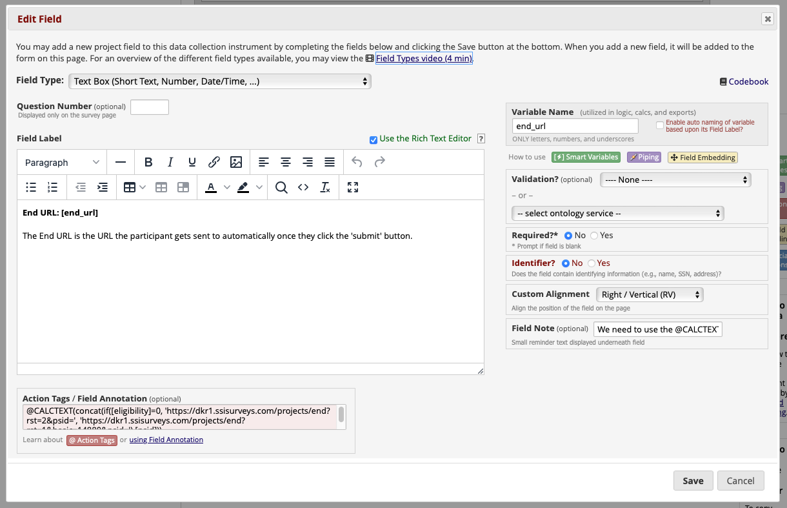
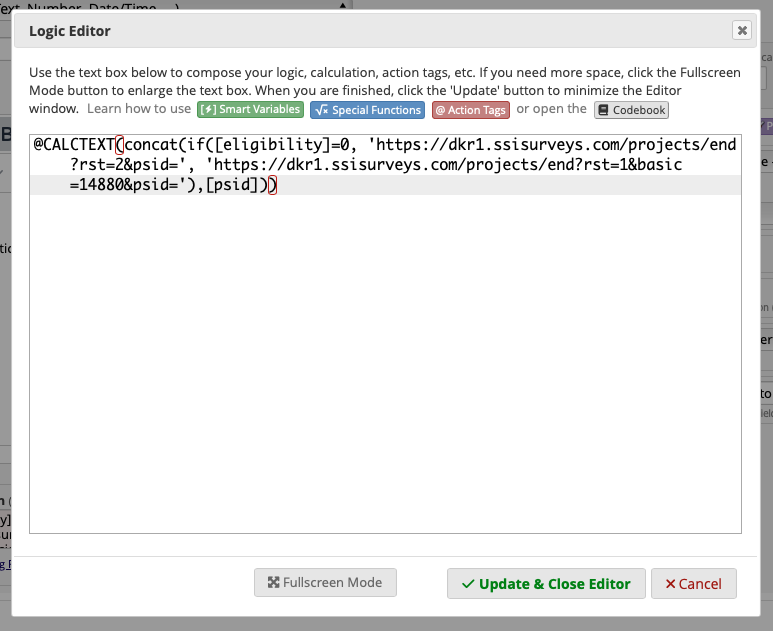
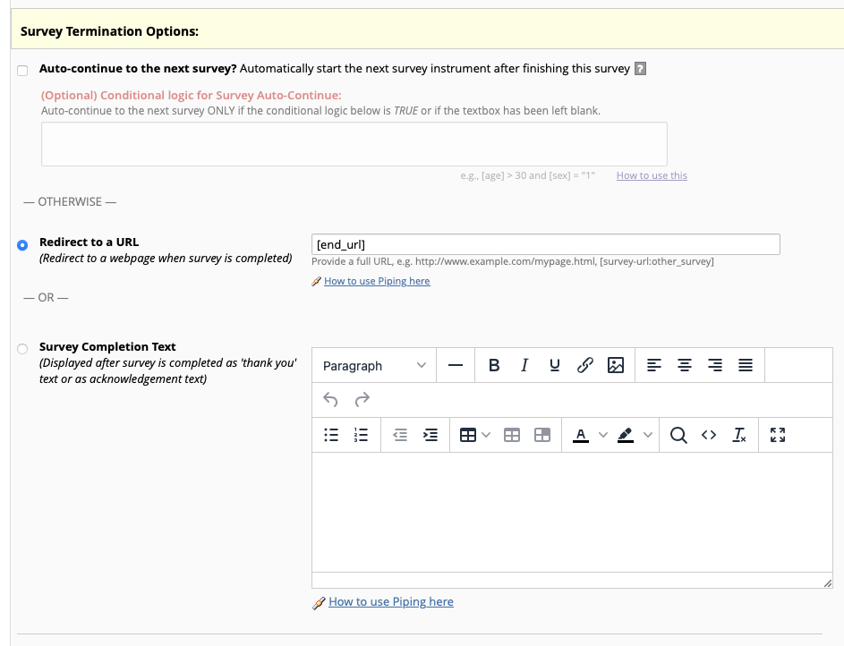

# Passthrough parameters
{: .no_toc }

## Table of contents
{: .no_toc .text-delta }

1. TOC
{:toc}

## About panel companies and passthrough parameters

When working with a panel company (a company that provides survey participants for researchers), they usually require you to capture an ID of a participant via a URL parameter, then pass that ID back out to them once the participant has completed the survey or screened them out, so that the participant can be paid for their work. 

## Capturing a value from the URL

First, we need to capture the participant ID from the URL parameter. Parameters are carried in URL in the form:

`https://somedomain.com/page.html?foo=bar`

In this case the parameter is `foo` and the value of that parameter is `bar`. To capture that value in REDCap, we need to make sure that the URL that loads the survey (note: this method only works with instruments that are enabled as surveys) contains the parameter you want. It will be in the form: 

`https://www151.griffith.edu.au/redcap/surveys/?s=FWXWYEYMLCKXFDJL&psid=1234`

`Psid` can have any value, provided it doesn't contain any spaces or special characters. 

### Create a field with the same field name as the URL parameter

1. Create a new field of type `Text box`. 
2. Give it any label you prefer. 
3. Set the `Variable name` to **psid** (or whatever the name of your URL parameter is).
4. Add the action tag `@HIDDEN-SURVEY`. This will make sure the value of `psid` is not displayed on screen. 


Adding the @HIDDEN-SURVEY action tag
{: .fs-3 .fw-300 }

You can now set up the rest of your survey. In each completed record, the field `psid` will contain the value of the URL parameter that was passed into it. 

Unless you create some logic in your instrument to prevent it, it will be possible for participants to complete the survey without providing a value for `psid`. 
{: .note }

## Creating the outbound URL

When participants finish the survey, they need to be directed back to the panel company to show that they have completed the work. The `psid` needs to be embedded in that URL.

We need to use an action tag called @CALCTEXT to generate the final URL that participants are directed to when they click the 'Submit' button. We then use the `concat` function to concatenate the base URL with the relevant parameters, and the `if` function to decide which parameters should be added. 

1. Create a new field of type `Text field`. 
2. Give it any name you like.
3. Set the `Variable name` to **[end_url]**. We will use this later. 
4. In the `Action tag` section of the field settings, enter the following (note that this is demo code, yours will necessarily be different):

```
@CALCTEXT(concat(if([eligibility]=0, 'https://somepanelcompany.com/projects/end?rst=2&psid=', 'https://somepanelcompany.com/projects/end?rst=1&basic=14880&psid='),[psid]))
```


Creating the endURL field
{: .fs-3 .fw-300 }

### Code breakdown

#### Calctext
The `@CALCTEXT` action tag allows REDCap to perform text operations without treating the text as a value. We need to do this to build the URL. 

#### Concat
The `concat` function concatenates strings. It uses the pattern: `concat(string1,string2,string3)` to create a final string of the form `string1string2string3`. 

#### If
The `if` function returns different values depending on some logical evaluation. It uses the pattern: `if(logical-test, value-if-true, value-if-false`). 


The equation in the Action tag editor
{: .fs-3 .fw-300 }

In this case, if `eligibility` is 0 (i.e. the participant is ineligible), we apply the following parameters: 

```
rst=2
psid={the value of psid}
```

Alternatively, if `eligibility` is 1 (i.e. the participant is eligible), we apply the following parameters:

```
rst=1
basic=14880
psid={the value of psid}
```

Of course, the actual parameters and values are completely up to you, but will probably be supplied to you by the panel company. 

URL shortening and redirection services like bit.ly do not pass through URL parameters unless they were part of the original URL. Since in this case, the parameter needs to be different every time, shortened or customised URLs can't be used.
{: .warning }

## Add the customised URL to the survey settings

Once you have tested the logic and made sure that the URL is being composed as you want, you can add it to the survey settings. 
1. Open the `Survey settings` for the survey you are editing.
2. Scroll down to `Survey termination options`.
3. Select the `Redirect to a URL` radio button.
4. Enter the Variable name of the URL that you have composed. 


Adding the End URL to the survey settings.
{: .fs-3 .fw-300 }

When the participant completes the survey, they will be automatically directed to one of the URLs built by your expression in the [end_url] field. 